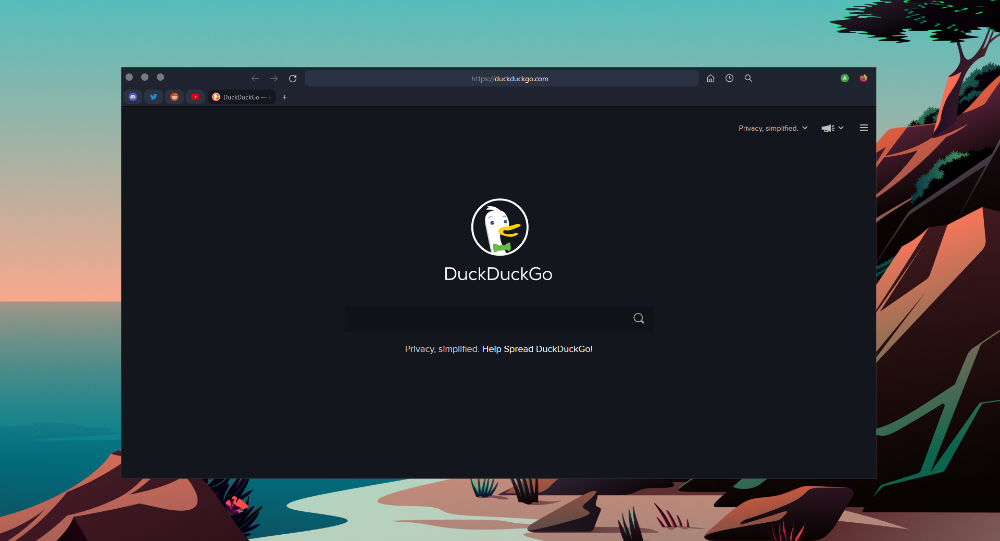
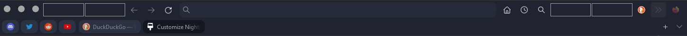

<h1>nightfox</h1>

`nightly version 91` / [`install guide`](https://github.com/synthicy/nightfox/blob/master/readme.md#installation) / [`nightfall theme`](https://github.com/nghtfall)

## Installation

1. Go to *`about:config`* and enable *`toolkit.legacyUserProfileCustomizations.stylesheets`*.

2. Locate your profile location by going to *`about:support`* and clicking *`Open folder`* in *`Profile folder`*.

3. Clone this repository by running `git clone https://github.com/synthicy/nightfox`.

4. Paste the `chrome` folder into the correct profile folder.

For the blur style to work enable `layout.css.backdrop-filter.enabled` in `about:config`.

5. Copy these customization settings to get the exact spacing and look you see in the preview. You can use the `Flexible Spaces` for the gaps.

## DuckDuckGo

Want to get this DuckDuckGo theme? Go to [`https://duckduckgo.com/settings#theme`](`https://duckduckgo.com/settings#theme`) and enter the password **`nightfall`**.

## Credits

**`Nightfox is based off of:`** [`https://github.com/datguypiko/Firefox-Mod-Blur`](https://github.com/datguypiko/Firefox-Mod-Blur)
